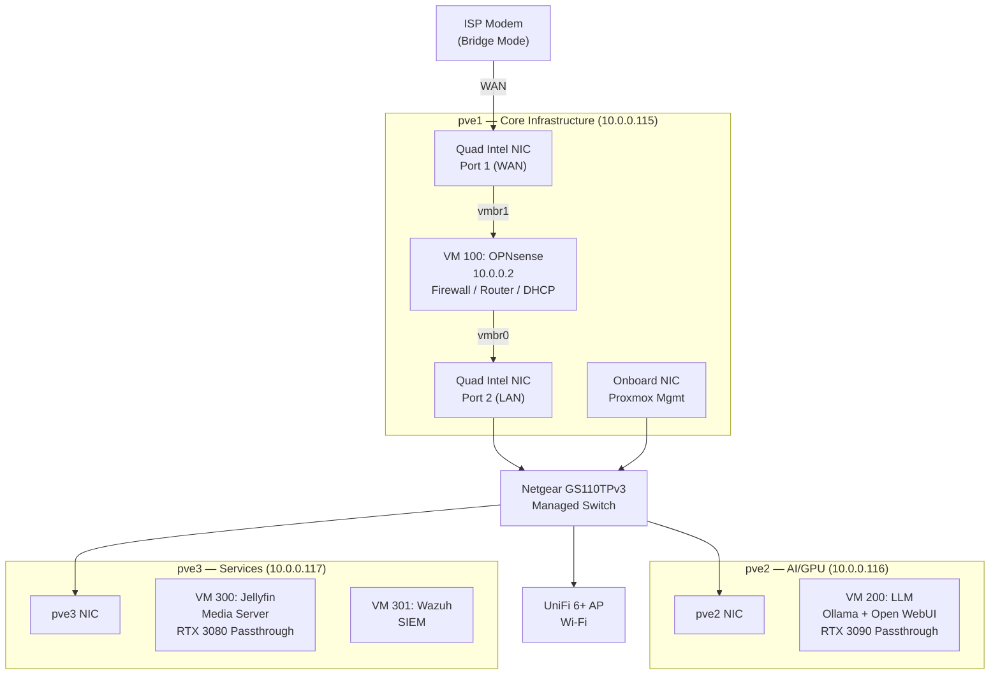
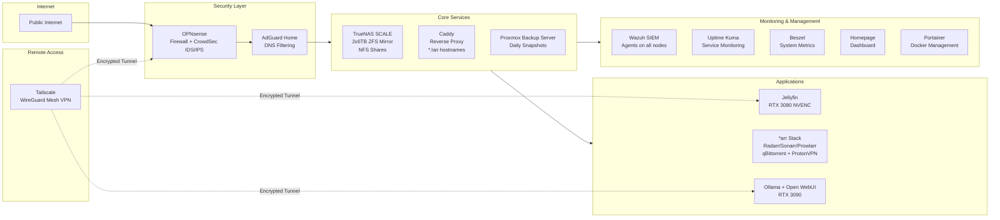

# Network Architecture

## Physical Topology



## Logical Service Map



## IP Address Map

| IP | Hostname | Type | Node | Service |
|----|----------|------|------|---------|
| 10.0.0.2 | opnsense.lan | VM 100 | pve1 | Firewall, Router, DHCP, CrowdSec IDS/IPS |
| 10.0.0.3 | adguard.lan | CT 101 | pve1 | DNS Filtering (AdGuard Home) |
| 10.0.0.4 | caddy | CT 102 | pve1 | Reverse Proxy (all *.lan routes) |
| 10.0.0.5 | truenas.lan | VM 103 | pve1 | NAS - TrueNAS SCALE, 2x6TB ZFS mirror |
| 10.0.0.6 | jellyfin.lan | VM 300 | pve3 | Media Server (RTX 3080 NVENC transcoding) |
| 10.0.0.7 | homepage.lan | CT 104 | pve1 | Dashboard |
| 10.0.0.9 | uptime.lan | CT 106 | pve1 | Service Uptime Monitoring |
| 10.0.0.10 | beszel.lan | CT 107 | pve1 | Server Metrics (agents on all nodes) |
| 10.0.0.11 | arr-stack | VM 108 | pve1 | Radarr, Sonarr, Prowlarr, qBittorrent, ProtonVPN |
| 10.0.0.12 | pbs.lan | VM 109 | pve1 | Proxmox Backup Server |
| 10.0.0.14 | wazuh | VM 301 | pve3 | Wazuh SIEM (Manager + Indexer + Dashboard) |
| 10.0.0.15 | portainer.lan | CT 110 | pve1 | Docker Management (agents on Jellyfin + arr-stack) |
| 10.0.0.115 | pve1 | Host | — | Proxmox Node 1 (Cluster Founder) |
| 10.0.0.116 | pve2 | Host | — | Proxmox Node 2 |
| 10.0.0.117 | pve3 | Host | — | Proxmox Node 3 |

## Traffic Flow

```
User Request → AdGuard DNS (resolves *.lan → 10.0.0.4) → Caddy Reverse Proxy → Backend Service

Example: "jellyfin.lan" → AdGuard resolves to 10.0.0.4 → Caddy proxies to 10.0.0.6:8096

Remote Access: Phone → Tailscale (WireGuard tunnel) → Jellyfin VM directly (bypasses Caddy)

Torrent Traffic: qBittorrent → Gluetun VPN Container → ProtonVPN Tunnel → Internet
                 (kill switch: if VPN drops, all traffic stops — containers can't bypass Gluetun)
```
